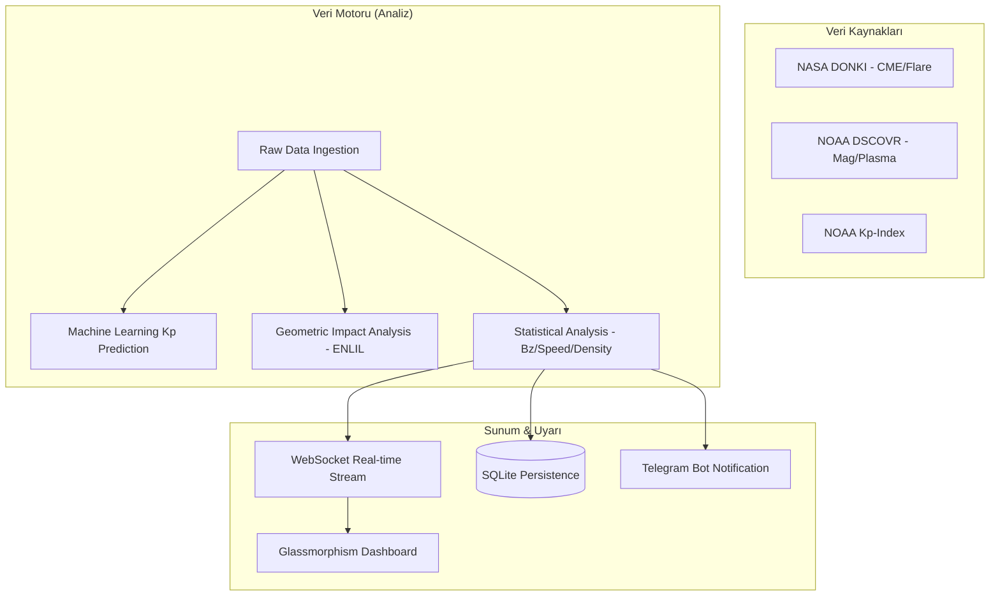

# ASA — Solar Storms Early Warning Network
### (Advanced Space Analytics & Early Warning System)

[](https://www.python.org/)
[](https://fastapi.tiangolo.com/)
[](https://api.nasa.gov/)
[](https://opensource.org/licenses/MIT)

ASA, NASA ve NOAA'dan gelen multi-spektral verileri işleyerek, Dünya'yı etkileyebilecek güneş fırtınalarını ve jeomanyetik bozulmaları önceden tespit eden **proaktif bir erken uyarı platformudur.**

---

## Sistem Mimarisi & Teknik Detaylar

ASA, monolitik bir yapıdan ziyade, veri çekme (Ingestion), analiz (Analysis) ve bildirim (Notification) katmanlarından oluşan modüler bir mimariye sahiptir.

### Genel Akış (Data Pipeline)


### Analiz Metodolojisi
Sistem, tehdit seviyesini belirlemek için **Ağırlıklı Puanlama Algoritması (Weighted Scoring)** kullanır:
- **NOAA Canlı Veri (%40):** DSCOVR uydusundan gelen anlık Bz (manyetik alan bileşeni), hız ve yoğunluk verileri.
- **NASA CME Tahmini (%25):** ENLIL modellerinden gelen Earth-Impact (Dünya Etkisi) bayrakları ve şok varış süreleri.
- **NOAA Kp-İndeksi (%20):** Mevcut jeomanyetik fırtına şiddeti.
- **NASA Solar Flare (%15):** X ve M sınıfı patlamaların iyonosferik etkileri.

---

## Öne Çıkan Özellikler

- **72 Saatlik Proaktif Tahmin:** Sadece anlık durumu değil, ENLIL model çıktılarını analiz ederek önümüzdeki 3 günün risk haritasını çıkarır.
- **ML Destekli Kp Tahmini:** `Scikit-learn` ile eğitilmiş model, güneş rüzgarı parametrelerini kullanarak anlık Kp değerini tahmin eder (0-9 ölçeğinde).
- **L1 Noktası Gecikme Analizi:** Güneş rüzgarı hızına bağlı olarak, fırtınanın L1 noktasından Dünya'ya varış süresini dinamik olarak hesaplar.
- **SDO Entegrasyonu:** NASA Solar Dynamics Observatory'den gelen en güncel HMI/AIA görüntülerini işleyerek görsel analiz sunar.
- **Çok Katmanlı Bildirim:** Kritik eşik aşıldığında (K > 5 veya Bz < -10nT) anında Telegram üzerinden teknik detayları içeren uyarılar gönderir.

---

## Kurulum ve Çalıştırma

### 1. Ortamın Hazırlanması
```bash
# Depoyu klonlayınız
git clone https://github.com/kullanici/ASA.git
cd ASA

# Sanal ortam oluşturup aktive ediniz
python -m venv .venv
source .venv/bin/activate  # Windows: .venv\Scripts\activate

# Bağımlılıkları yükleyiniz
pip install -r requirements.txt
```

### 2. Konfigürasyon
Kök dizinde bir `.env` dosyası oluşturarak API anahtarlarınızı tanımlayınız:
```env
NASA_API_KEY="Sizin_NASA_API_Anahtariniz"
TELEGRAM_BOT_TOKEN="Bot_Token_Buraya"
TELEGRAM_CHAT_ID="Bildirim_Gidecek_Grup_ID"
```

### 3. Uygulamayı Başlatma
```bash
uvicorn main:app --reload --host 0.0.0.0 --port 8000
```
- **Dashboard:** `http://localhost:8000/app/index.html`
- **ML Monitor:** `http://localhost:8000/app/monitor.html`
- **Swagger:** `http://localhost:8000/docs`

---

## API Referansı

| Endpoint | Metot | Açıklama |
| :--- | :---: | :--- |
| `/status` | `GET` | NASA/NOAA birleştirilmiş analiz motoru çıktısı. |
| `/history` | `GET` | Veritabanındaki son 100 tehdit kaydı. |
| `/monitor/predict` | `GET` | Parametrik Kp-Index tahmini (Simülasyon). |
| `/ws` | `WS` | Anlık veri akışı sağlayan WebSocket kanalı. |

---

## Proje Yapı Taşı (Core Files)

- `main.py`: FastAPI uygulama iskeleti ve WebSocket yönetimi.
- `veri_motoru.py`: NASA/NOAA API entegrasyonu ve ağırlaştırılmış analiz algoritmaları.
- `database.py`: SQLite/SQLAlchemy ile veri persistency (kalıcılık) katmanı.
- `notifications.py`: Asenkron Telegram uyarı motoru.
- `frontend/`: Glassmorphism prensiplerine uygun olarak geliştirilmiş duyarlı arayüz.

---

## Katkıda Bulunma ve Lisans

Bu proje bir Hackathon ürünüdür. Veri setleri ve API desteği için **NASA DONKI** ve **NOAA Space Weather Prediction Center** ekiplerine teşekkür ederiz.

**Lisans:** MIT License. Ücretsiz ve açık kaynaklıdır.
